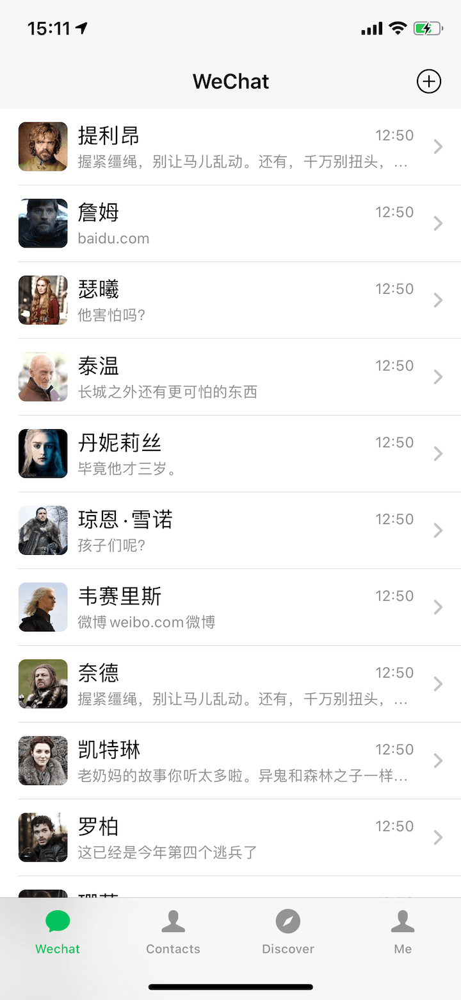
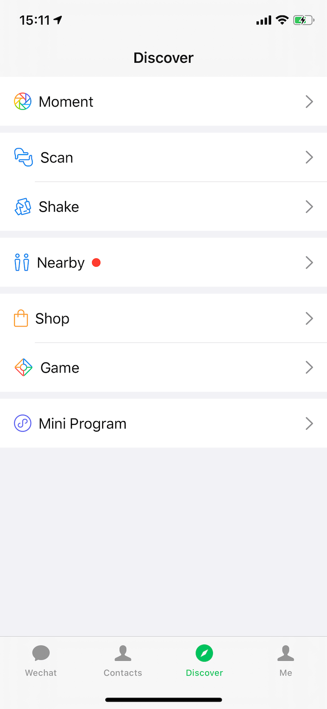
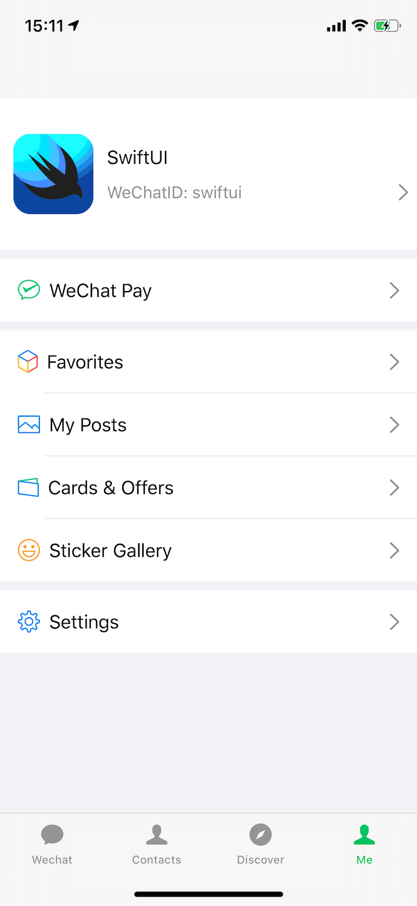

# WeChatUI
Create WeChat with SwiftUI

A startup project for learning SwiftUI.

## Status

- [x] Session
  - [ ] ChatRoom
- [ ] Contacts
- [ ] Discover
  - [ ] Moment
- [ ] Me
  - [ ] Settings

## Previews

